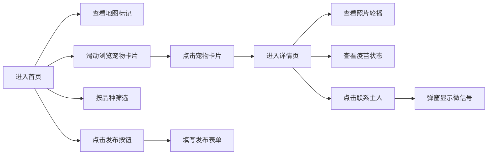

## 1. 产品概述

小区宠物互助平台，为附近养猫养狗的居民提供宠物信息展示、互助交流的社区平台。帮助用户快速找到周边的宠物伙伴，了解宠物信息，方便邻里之间的宠物互助。

## 2. 核心功能

### 2.1 用户角色
| 角色 | 注册方式 | 核心权限 |
|------|----------|----------|
| 普通用户 | 无需注册（浏览模式） | 浏览宠物列表、查看宠物详情、查看联系方式 |

### 2.2 功能模块
1. **首页**：搜索筛选栏、占位地图区域、横向滑动宠物卡片列表、发布按钮
2. **详情页**：照片轮播、主人信息、疫苗标签、性格描述、联系主人按钮

### 2.3 页面详情
| 页面名称 | 模块名称 | 功能描述 |
|----------|----------|----------|
| 首页 | 搜索筛选栏 | 顶部固定搜索栏，按宠物品种进行筛选 |
| 首页 | 地图区域 | 左侧占位地图，用标记点展示宠物位置 |
| 首页 | 宠物卡片列表 | 右侧横向滑动列表，展示宠物头像、名字、品种、距离 |
| 首页 | 发布按钮 | 右上角发布按钮，点击弹出发布表单 |
| 详情页 | 照片轮播 | 顶部多张宠物照片自动轮播 |
| 详情页 | 主人信息 | 主人头像和昵称展示 |
| 详情页 | 疫苗标签 | 绿底"已打"或灰底"未打"标签 |
| 详情页 | 性格描述 | 宠物性格特点文字描述 |
| 详情页 | 联系主人 | 点击弹窗显示微信号 |

## 3. 核心流程

## 4. 用户界面设计

### 4.1 设计风格
- **主色调**：奶咖色 #F5E6D3（背景色）
- **强调色**：森林绿 #4A6741（按钮、标签）
- **卡片风格**：圆角 16px，带轻微阴影（box-shadow: 0 4px 12px rgba(0,0,0,0.08)）
- **字体**：使用温暖友好的无衬线字体
- **整体风格**：温馨、自然、社区感

### 4.2 页面设计概述
| 页面名称 | 模块名称 | UI 元素 |
|----------|----------|----------|
| 首页 | 搜索筛选栏 | 圆角输入框、森林绿边框、品种下拉选择 |
| 首页 | 地图区域 | 奶咖色背景、网格线装饰、彩色位置标记 |
| 首页 | 宠物卡片 | 圆角头像、名字加粗、品种标签、距离显示 |
| 首页 | 发布按钮 | 圆形浮动按钮、森林绿背景、白色加号 |
| 详情页 | 照片轮播 | 圆角大图、指示器圆点、左右切换箭头 |
| 详情页 | 主人信息 | 圆形头像、昵称文字 |
| 详情页 | 疫苗标签 | 圆角矩形标签、绿/灰背景、白色文字 |
| 详情页 | 联系按钮 | 圆角大按钮、森林绿背景、居中文字 |

### 4.3 响应式设计
- 桌面端：左右分栏布局（地图+列表）
- 移动端：上下堆叠布局，列表改为垂直滚动
- 触摸优化：卡片点击区域 ≥ 44x44px

### 4.4 组件拆分
1. **PetCard** - 宠物卡片组件
2. **Tag** - 标签组件（疫苗标签等）
3. **PhotoSlider** - 照片轮播组件
4. **Modal** - 弹窗组件（发布表单、联系方式）
