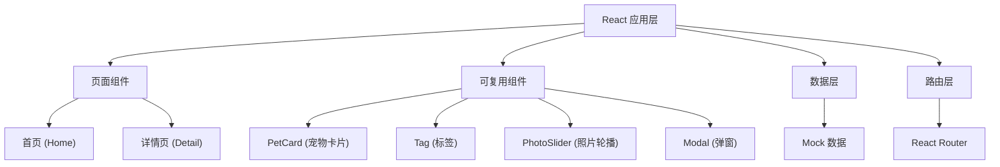

## 1. 架构设计



## 2. 技术描述

- **前端框架**：React@18 + TypeScript
- **构建工具**：Vite@5
- **样式方案**：Tailwind CSS@3
- **路由管理**：React Router DOM@6
- **数据方式**：Mock 数组（写死在代码中）
- **图标方案**：Lucide React

## 3. 路由定义

| 路由 | 用途 |
|------|------|
| / | 首页，地图+列表混合布局 |
| /pet/:id | 宠物详情页 |

## 4. 数据模型

### 4.1 宠物数据类型

```typescript
interface Pet {
  id: number;
  name: string;
  breed: string;
  species: 'dog' | 'cat';
  avatar: string;
  photos: string[];
  distance: number;
  vaccinated: boolean;
  personality: string;
  owner: {
    name: string;
    avatar: string;
    wechat: string;
  };
  location: {
    x: number;
    y: number;
  };
}
```

### 4.2 Mock 数据示例

```typescript
const mockPets: Pet[] = [
  {
    id: 1,
    name: '豆豆',
    breed: '金毛犬',
    species: 'dog',
    avatar: 'https://images.unsplash.com/photo-1552053831-71594a27632d?w=200&h=200&fit=crop',
    photos: [...],
    distance: 150,
    vaccinated: true,
    personality: '活泼好动，喜欢交朋友，对人非常友好',
    owner: { name: '小明', avatar: '...', wechat: 'xiaoming123' },
    location: { x: 30, y: 40 }
  }
];
```

## 5. 项目目录结构

```
project62/
├── src/
│   ├── components/
│   │   ├── PetCard.tsx
│   │   ├── Tag.tsx
│   │   ├── PhotoSlider.tsx
│   │   └── Modal.tsx
│   ├── pages/
│   │   ├── Home.tsx
│   │   └── PetDetail.tsx
│   ├── data/
│   │   └── mockPets.ts
│   ├── types/
│   │   └── index.ts
│   ├── App.tsx
│   ├── main.tsx
│   └── index.css
├── tailwind.config.js
├── vite.config.ts
└── package.json
```

## 6. 主题配置

在 tailwind.config.js 中配置自定义颜色：

```javascript
module.exports = {
  theme: {
    extend: {
      colors: {
        cream: '#F5E6D3',
        forest: '#4A6741',
        'forest-light': '#5C7A52',
        'cream-dark': '#E8D5BC',
      },
      borderRadius: {
        'card': '16px',
      },
      boxShadow: {
        'card': '0 4px 12px rgba(0, 0, 0, 0.08)',
        'card-hover': '0 8px 24px rgba(0, 0, 0, 0.12)',
      }
    }
  }
}
```
